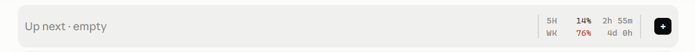

# Claude Code Mods: Usage Limits Tracker & One-Click Next Steps

**See your Claude Code 5-hour and weekly usage limits at all times**, get **one-click next-step suggestions** after every reply, and open a new chat or push to GitHub in one click. Free, open-source [Claude Code mods](https://code.claude.com/docs/en/plugins/mods/overview) for the **Claude Desktop app** (Code tab) and the **Claude Code terminal**.

Website: **https://pawandeepdhall.github.io/claude-mods/**



Install in 30 seconds:

```bash
claude plugin marketplace add pawandeepdhall/claude-mods
claude plugin install usage-band@my-claude-mods
claude plugin install next-steps@my-claude-mods
```

---

## usage-band: always-visible Claude usage limits

Stop guessing how close you are to your Claude limit or running `/usage` again and again. `usage-band` pins a small widget above the prompt that shows:

- **5-hour limit**: percentage used and a countdown to when it resets (↻ 2h 55m)
- **Weekly limit**: percentage used and the days and hours until it resets (↻ 4d 0h)
- **Early warning**: the percentage turns amber when you are close, and red when you are near the limit or on pace to hit it before it resets
- **＋ New chat** button: opens a brand-new chat in one click (presses Ctrl+N / Cmd+N for you)
- **↑ Push** button (git projects only): asks Claude to commit your changes and push them to GitHub

It updates on its own, works on Pro and Max plans, shows Team and Enterprise spend limits, and hides itself on API-key accounts, where there are no limits to show. It follows your light or dark theme.

## next-steps: one-click next-step suggestions in Claude Code

Not sure what to ask next? After every reply, `next-steps` shows **up to 6 suggested next steps in two columns** on the left of the band, such as *Add tests for the parser* or *Deploy to staging*.

- **Tick one or more, then press Send.** The ticked steps go to Claude as one message.
- **Send writes a proper prompt, not a one-liner:** it names the files, commands and values from your conversation, adds the context Claude needs and says what done looks like. Several steps become a numbered plan.
- Labels are short (10 words or fewer) and specific to what you just asked and what Claude answered
- They hide while Claude is working and refresh after each reply; typing your own message clears them
- Uses one small Haiku request per reply for the labels, and one Sonnet request when you press Send

## Requirements

Claude Code **v2.1.287 or later** (mods are built in from that version). The Claude Desktop app updates itself. In a terminal, check with `claude --version` and update with:

```bash
npm install -g @anthropic-ai/claude-code@latest
```

## Install

Run these once per computer (no GitHub account needed):

```bash
claude plugin marketplace add pawandeepdhall/claude-mods
claude plugin install usage-band@my-claude-mods
claude plugin install next-steps@my-claude-mods
```

Or inside a Claude Code session: `/plugin marketplace add pawandeepdhall/claude-mods`, then `/plugin install usage-band@my-claude-mods`. In a session that was already open, run `/reload-plugins`.

## Update

```bash
claude plugin marketplace update my-claude-mods
claude plugin update usage-band@my-claude-mods
claude plugin update next-steps@my-claude-mods
```

## What these mods can access

Mods run with your permissions, so here is exactly what each one does. Check it yourself with `claude plugin validate ./plugins/<mod>`.

- **usage-band** reads your session's usage figures (`$.session.usage`), checks whether the folder is a git repo (`git rev-parse`), runs a one-line script that presses Ctrl+N when you click **＋**, and submits a commit-and-push request to Claude when you click **↑**. Nothing is sent anywhere else.
- **next-steps** sends your last request and Claude's last answer (trimmed) through your own Claude Code session (`$.model.complete`): to Haiku to write the suggestions, and to Sonnet when you press Send to write the message, which it then submits as yours. Nothing is sent anywhere else.

## FAQ

**How do I see my Claude Code usage limit?** Install `usage-band`. Your 5-hour and weekly usage show above the prompt in every session.

**When does my Claude 5-hour limit reset?** `usage-band` shows a live countdown (↻) next to each limit.

**Can Claude Code suggest what to do next?** Yes. With `next-steps`, up to 6 suggested next steps appear after every reply; tick one or more and press Send, and it writes a detailed prompt for Claude.

**Does it work in the Claude Desktop app?** Yes. Both mods work in the Desktop app's Code tab and in the terminal.

## Contributing

Ideas and pull requests are welcome. Each mod is a folder under `plugins/`; add a new one and list it in `.claude-plugin/marketplace.json`.

Keywords: Claude Code mod, Claude Code plugin, Claude usage tracker, Claude usage limit, 5-hour limit, weekly limit, rate limit monitor, Claude Desktop, next steps, follow-up suggestions, prompt suggestions, Anthropic Claude.

## License

MIT. See [LICENSE](LICENSE).
